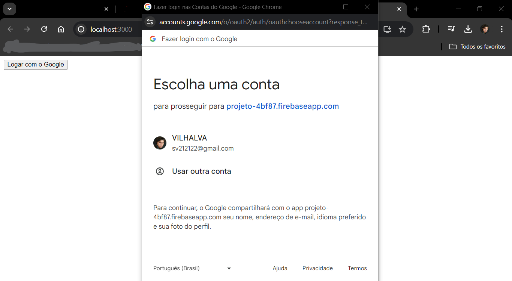
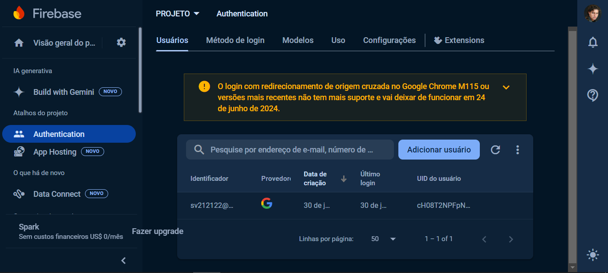

# AUTENTICACAO DO GOOGLE COM FIREBASE
👨‍🏫APP DE AUTENTICACAO DO GOOGLE COM REACT E FIREBASE!

 <br> 
 <br> 
 <br> 

## DESCRIÇÃO:
Este aplicativo React utiliza o contexto de autenticação do Google para gerenciar login e logout. Ele oferece duas funcionalidades principais:

1. **Login com Google**:
   - Permite que os usuários façam login com suas contas do Google.

2. **Página de Home**:
   - Exibe uma mensagem de boas-vindas ao usuário logado e permite que ele saia (logout).

## EXECUTANDO O PROJETO:
1. **Criar o app no Firebase**
   1. **Acesse o Firebase Console**:
      - Vá para [Firebase Console](https://console.firebase.google.com/).

   2. **Crie um Novo Projeto**:
      - Clique em "Adicionar projeto".
      - Dê um nome ao seu projeto e siga as instruções para configurá-lo.
      - Quando solicitado, você pode optar por habilitar o Google Analytics para seu projeto (opcional).

   3. **Configuração do Projeto**:
      - Após a criação do projeto, você será redirecionado para o painel do projeto.
      - Clique no ícone de configurações ao lado do nome do projeto e selecione "Configurações do projeto".
      - No menu de configurações, selecione "Suas apps" e clique no ícone do Firebase para web (</>) para criar um novo app web.
      - Dê um nome ao app e clique em "Registrar app".

   4. **Obter Configuração do Firebase**:
      - Após registrar o app, você verá as configurações do Firebase, incluindo o `apiKey`, `authDomain`, `projectId`, etc.
      - Copie essas informações. Você precisará delas para configurar o Firebase na sua aplicação React.

   5. **Configurar Firebase no Projeto**:
      - Adicione a configuração do Firebase no arquivo `./CODIGO/src/services/firebaseConfig.js`, usando as informações copiadas do console do Firebase. O código deve ser semelhante ao seguinte:
      ```javascript
      // src/services/firebaseConfig.js
      import { initializeApp } from "firebase/app";

      const firebaseConfig = {
      apiKey: "SUA_API_KEY",
      authDomain: "SEU_AUTH_DOMAIN",
      projectId: "SEU_PROJECT_ID",
      storageBucket: "SEU_STORAGE_BUCKET",
      messagingSenderId: "SEU_MESSAGING_SENDER_ID",
      appId: "SEU_APP_ID",
      measurementId: "SEU_MEASUREMENT_ID",
      };

      export const app = initializeApp(firebaseConfig);
      ```

   6. **Configurar Provedores de Autenticação**:
      - No console do Firebase, vá para a seção "Authentication".
      - Clique na guia "Método de login".
      - Ative o provedor do Google clicando em "Google" e habilitando-o. Configure as opções solicitadas e salve as mudanças.

2. **Instalando as Dependências:**
   - Para instalar as dependências listadas no arquivo "package.json", você pode usar o comando `npm install` no terminal. Certifique-se de estar no diretório `CODIGO/`, e execute o seguinte comando:
   ```bash
   npm install
   ```

3. **Executando o Aplicativo:**
   - Para iniciar o servidor, abra o terminal e execute o seguinte comando:
   ```bash
   npm start
   ```

   - Acesse o aplicativo no navegador visitando [http://localhost:3000/](http://localhost:3000/).

4. **Interagindo com o Aplicativo:**
   1. **Acesse a Página de Login**:
      - Verifique se o usuário já está logado.

   2. **Botão de Login com Google**:
      - Se o usuário não estiver logado, exiba o botão "Logar com o Google".
      - Clique no botão "Logar com o Google" para iniciar o processo de autenticação.

   3. **Autenticação com Google**:
      - Inicie a autenticação com o Google ao clicar no botão.
      - Redirecione o usuário para a página "Home" após a autenticação bem-sucedida.

## NÃO SABE?
- Entendemos que para manipular arquivos em `HTML`, `CSS` e outras linguagens relacionadas, é necessário possuir conhecimento nessas áreas. Para auxiliar nesse aprendizado, oferecemos cursos gratuitos disponíveis:
* [CURSO DE HTML E CSS](https://github.com/VILHALVA/CURSO-DE-HTML-E-CSS)
* [CURSO DE JAVASCRIPT](https://github.com/VILHALVA/CURSO-DE-JAVASCRIPT)
* [CURSO DE NODEJS](https://github.com/VILHALVA/CURSO-DE-NODEJS)
* [CURSO DE REACT](https://github.com/VILHALVA/CURSO-DE-REACT)
* [CONFIRA MAIS CURSOS](https://github.com/VILHALVA?tab=repositories&q=+topic:CURSO)

## CREDITOS:
- [PROJETO CRIADO PELO "Rodrigo322"](https://github.com/Rodrigo322/Auntentica-aoFirebaseReact)
- [VEJA O VIDEO DESSE PROJETO](https://youtu.be/XjNs_OM6m8A?si=prQYTExvHMBkbEyF)
- [PROJETO EDITADO PELO VILHALVA](https://github.com/VILHALVA)


